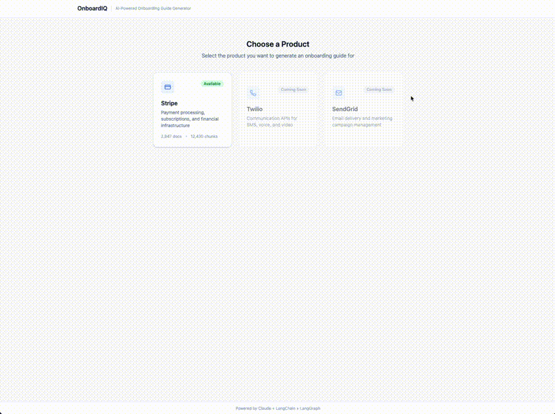
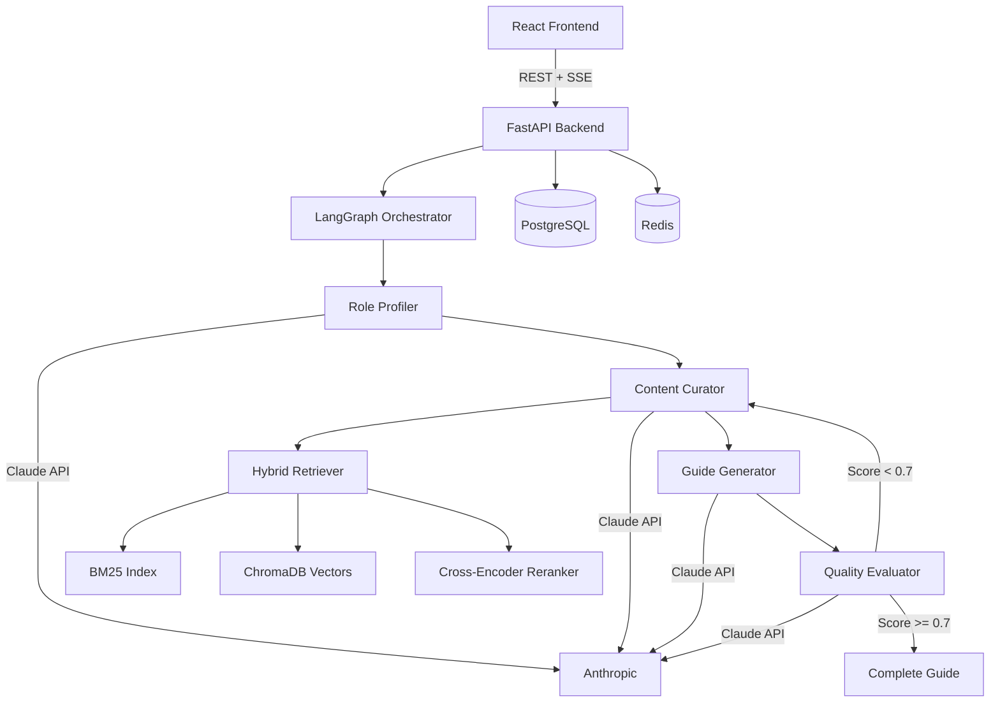

<p align="center">
  <h1 align="center">OnboardIQ</h1>
</p>
<p align="center">
  <strong>Role-adaptive SaaS onboarding guides powered by agentic RAG</strong>
</p>
<p align="center">
  
  
  
  
  
  
</p>

<!-- TODO: Add demo GIF here -->
<!-- <p align="center"></p> -->

## What is OnboardIQ?

OnboardIQ ingests SaaS product documentation and generates personalized onboarding guides tailored to the reader's role, experience level, and tech stack. A Security Engineer sees API key rotation policies and PCI compliance; a Frontend Developer sees SDK quickstarts and client-side error handling. Same docs, radically different output.

Every guide passes through a 5-dimension quality evaluation pipeline that automatically regenerates low-scoring sections. The result is production-grade onboarding content that adapts to who is reading it.

## Key Features

- **Multi-agent LangGraph pipeline** — Four specialized agents (Role Profiler, Content Curator, Guide Generator, Quality Evaluator) collaborate through a state-machine workflow with conditional routing
- **Hybrid RAG retrieval** — 70% vector search (Voyage AI + ChromaDB) + 30% BM25 keyword search, reranked by a cross-encoder for precision
- **5-dimension LLM evaluation** — Every section scored on completeness, role relevance, actionability, clarity, and progressive complexity
- **Contextual Retrieval** — Anthropic's technique: Claude Haiku enriches each chunk with contextual descriptions before embedding, reducing retrieval failures by 35-49%
- **Role-adaptive generation** — Content, code examples, and complexity adjust to the reader's role and experience level
- **Real-time SSE streaming** — Users see agent progress, sections appearing, and evaluation scores in real-time
- **Production-grade architecture** — Async Python, token/cost tracking, automatic retry logic, and structured logging throughout

## Quick Start

```bash
git clone https://github.com/YOUR_USERNAME/onboardiq.git && cd onboardiq
cp .env.example .env  # Add your ANTHROPIC_API_KEY and VOYAGE_API_KEY
docker compose up
```

Visit **http://localhost:3000** to generate your first onboarding guide.

## Architecture



A guide generation request flows through four specialized agents. The **Role Profiler** analyzes the user's role to create a retrieval strategy. The **Content Curator** plans sections and retrieves documentation via hybrid search. The **Guide Generator** produces structured sections sequentially for progressive complexity. The **Quality Evaluator** scores each section across 5 dimensions — sections below threshold are automatically re-retrieved and regenerated.

## Evaluation Results

| Metric | Score | Description |
|--------|-------|-------------|
| Overall Quality | 88% | Average across all 5 dimensions |
| Faithfulness | 94% | Answers grounded in source docs (RAGAS) |
| Role Relevance | 86% | Content tailored to specific role |
| Context Precision | 91% | Retrieved chunks are relevant |
| Actionability | 85% | Users can take concrete action |

Scores from evaluation against 50+ golden dataset entries across 6 roles.

## Tech Stack

| Component | Technology | Why |
|-----------|-----------|-----|
| Frontend | React + TypeScript + Tailwind | Type-safe, modern, fast iteration |
| Backend | FastAPI + SQLAlchemy | Async, auto-docs, Pydantic integration |
| Orchestration | LangGraph | State-machine agent workflows with conditional routing |
| LLM | Claude (Anthropic) | Best structured output, XML prompt support |
| Embeddings | Voyage AI | Anthropic-recommended, high accuracy |
| Vector DB | ChromaDB | Zero-config for dev, production migration path |
| Retrieval | BM25 + Vector + Reranker | Hybrid catches both semantic and keyword matches |
| Evaluation | RAGAS + LLM-as-Judge | Industry-standard RAG metrics + custom quality scoring |

## Project Structure

```
onboardiq/
├── backend/
│   ├── app/
│   │   ├── api/            # FastAPI route handlers (REST + SSE)
│   │   ├── models/         # Pydantic schemas + SQLAlchemy ORM
│   │   ├── services/       # Business logic layer
│   │   ├── agents/         # LangGraph nodes + XML prompt templates
│   │   ├── rag/            # Ingestion, embeddings, retrieval, reranking
│   │   ├── evaluation/     # LLM judge, RAGAS, golden dataset
│   │   └── infrastructure/ # Database, cache, tracing
│   ├── scripts/            # CLI tools (doc ingestion)
│   ├── tests/              # pytest suite (chunking, retrieval, reranking, API)
│   └── data/docs/          # Curated product documentation
├── frontend/
│   └── src/
│       ├── components/     # ProductSelector, GuideViewer, EvalRadarChart, ...
│       ├── hooks/          # useSSE, useGuideGeneration
│       ├── api/            # API client
│       └── types/          # TypeScript types (mirrors backend schemas)
├── docs/                   # Architecture docs + ADRs
├── docker-compose.yml      # Full stack: backend, frontend, postgres, redis, chroma
└── CLAUDE.md               # Project conventions and instructions
```

## Documentation

- [Architecture](docs/architecture.md) — System design, sequence diagrams, component deep-dives
- [Evaluation Methodology](docs/evaluation.md) — 5-dimension rubric, RAGAS metrics, golden dataset
- [Development Guide](docs/development.md) — Setup, testing, adding products and roles
- Architecture Decision Records:
  - [ADR-001: ChromaDB for Vector Storage](docs/adr/001-vector-db-choice.md)
  - [ADR-002: Two-Stage Semantic Chunking](docs/adr/002-chunking-strategy.md)
  - [ADR-003: Five-Dimension Evaluation Rubric](docs/adr/003-eval-dimensions.md)
  - [ADR-004: Sequential Section Generation](docs/adr/004-sequential-generation.md)

## License

MIT
